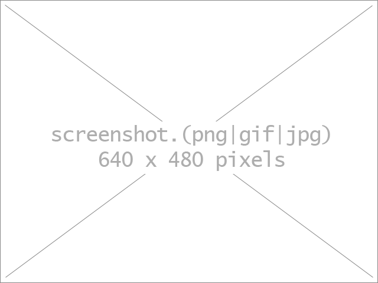

Title of your theme
====================

Theme for [YOURLS](http://yourls.org) `<here: min-version if applicable>`. 

Preview
-----------

*Tip: YOURLS will look for a file named `screenshot.(png|gif|jpg)` with a size of 640x480 pixels. Of course, your README can show another image, of any size*

Description
-----------
*Here*: replace this paragraph with a detailed description of your theme: what it improves, what it adds, or the default behavior it replaces. Use clear and short sentences. Be convincing.

Installation
------------
1. In `/user/themes`, create a new folder named `<here: your theme folder name>`.
2. Drop these files in that directory.
3. Go to the Themes administration page ( *eg* `http://sho.rt/admin/themes.php` ) and activate the theme.
4. Have fun!

License
-------
*Here*: your license type. Feel free to use YOURLS' license, aka *"Do whatever the hell you want with it"*.

One more thing
--------------
*Here*: any other content, as needed. An important information should be contact information for bug reports or user questions, if you decide not to use Github issues in your plugin repository.
